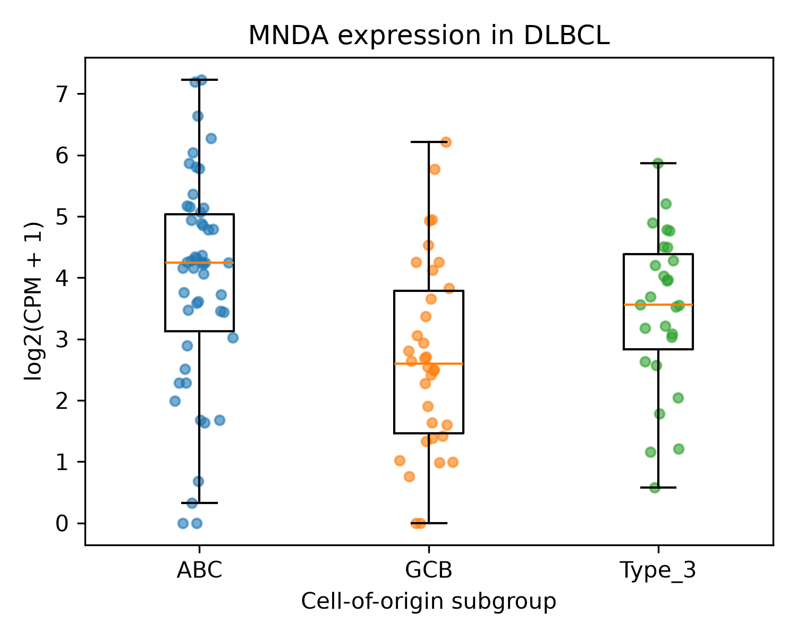
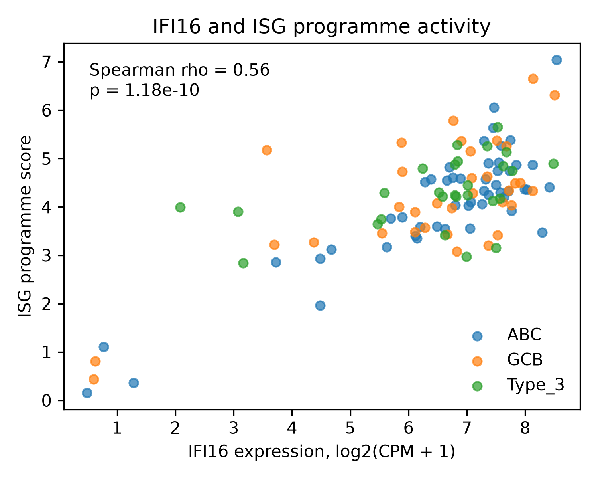
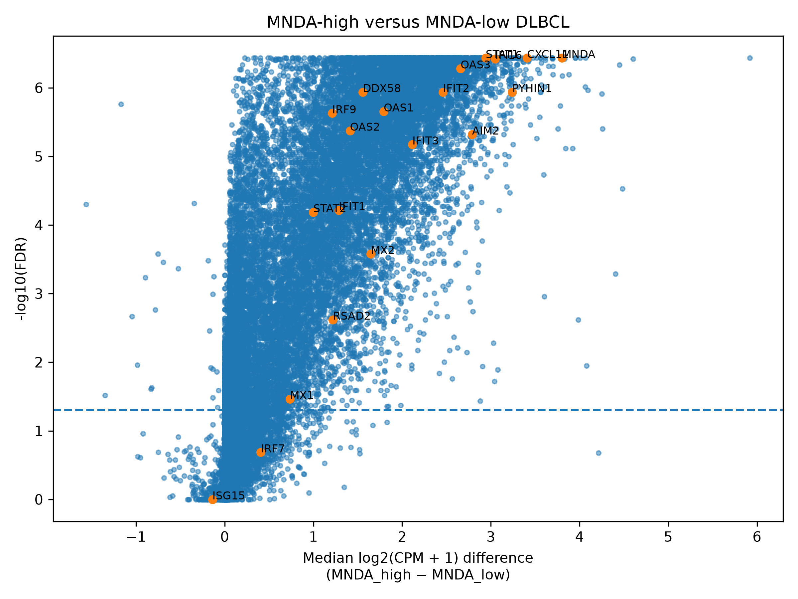
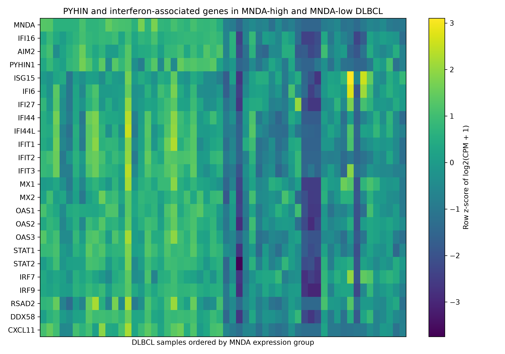

# Interferon-stimulated PYHIN proteins in diffuse large B-cell lymphoma (DLBCL)

Transcriptomic analysis of PYHIN-family gene expression and interferon-associated transcriptional programmes in primary diffuse large B-cell lymphoma.

This project investigates the expression of interferon-stimulated genes and proteins belonging to the PYHIN family in diffuse large B-cell lymphoma (DLBCL). Particular attention was given to the relationship between *MNDA*, *IFI16*, *AIM2*, *PYHIN1* and broader interferon-associated transcriptional programmes.

## Key findings

1. MNDA expression was significantly higher in ABC-DLBCL than in GCB-DLBCL (P = 7.84 × 10⁻⁴).

2. *IFI16*, *MNDA*, *AIM2* and *PYHIN1* expression positively correlated with global interferon programme activity.

3. MNDA-high tumours exhibited coordinated upregulation of canonical interferon-stimulated genes including *STAT1*, *OAS1–3*, *IFIT1–3*, *DDX58* and *CXCL11*.

4. A curated PYHIN/interferon gene set was significantly enriched among genes upregulated in MNDA-high tumours (odds ratio = 7.67, P = 5.9 × 10⁻⁵).

5. Results identify an interferon-associated transcriptional state characterised by coordinated activation of PYHIN-family and interferon-stimulated genes in primary DLBCL.

---

## Dataset

RNA sequencing count data were obtained from:

**GSE147986**  
*Transcriptome analysis of diffuse large B-cell lymphoma (DLBCL)*

A cohort of 111 primary DLBCL tumour samples with cell-of-origin (COO) classification.

Samples were classified as:

- ABC (Activated B-cell-like): n = 50
- GCB (Germinal centre B-cell-like): n = 34
- Type 3: n = 27

Raw gene-level count tables were downloaded from the Gene Expression Omnibus (GEO) and combined into a single expression matrix containing 33,126 genes across 111 samples.

---

## Study aims

The project focused on interferon-stimulated genes and PYHIN-family members implicated in innate immune signalling and interferon responses: *MNDA, IFI16, AIM2, PYHIN1*.

Additional analyses examined canonical interferon-stimulated genes including: *ISG15, IFI6, IFI27, IFI44, IFI44L, IFIT1, IFIT2, IFIT3, MX1, MX2, OAS1, OAS2, OAS3, STAT1, STAT2, IRF7, IRF9, DDX58, RSAD2, CXCL11*.

---

## Data processing

Raw counts were converted to counts-per-million (CPM) and transformed using:

```text
log2(CPM + 1)
```

All downstream analyses were performed using log-transformed expression values.

The workflow includes:

- count matrix generation
- metadata harmonisation
- CPM normalisation
- interferon programme scoring
- subgroup comparisons
- correlation analyses
- differential expression testing
- Fisher exact enrichment analysis
- figure generation

---

## Expression of PYHIN-family genes across DLBCL subgroups

Median expression values differed between COO subtypes.

| Gene | ABC | GCB | Type 3 |
|--------|--------|--------|--------|
| IFI16 | 7.16 | 6.86 | 6.84 |
| AIM2 | 5.41 | 5.70 | 5.39 |
| MNDA | 4.24 | 2.59 | 3.56 |
| PYHIN1 | 3.00 | 3.13 | 3.83 |

Among the investigated genes, MNDA showed the strongest difference between ABC and GCB tumours.

| Gene | ABC-GCB difference | P-value |
|--------|--------|--------|
| IFI16 | 0.30 | 0.575 |
| AIM2 | -0.28 | 0.557 |
| MNDA | 1.65 | 0.000784 |
| PYHIN1 | -0.13 | 0.264 |

### MNDA expression across COO subgroups



---

## Interferon programme activity

An interferon-stimulated gene (ISG) score was calculated from a panel of 20 canonical interferon-associated genes.

Median ISG programme activity:

| Group | Median ISG score |
|--------|--------|
| ABC | 4.31 |
| Type 3 | 4.24 |
| GCB | 4.19 |

The overall interferon programme was present across all COO subgroups and showed substantial inter-patient variability.

---

## Relationship between PYHIN genes and interferon signalling

PYHIN-family expression was positively associated with interferon programme activity.

| Gene | Spearman rho | P-value |
|--------|--------|--------|
| IFI16 | 0.564 | 1.18e-10 |
| MNDA | 0.540 | 9.60e-10 |
| PYHIN1 | 0.467 | 2.45e-07 |
| AIM2 | 0.301 | 1.33e-03 |

IFI16 and MNDA showed the strongest associations with global interferon programme activation.

### IFI16 expression and interferon programme activity



---

## MNDA-high versus MNDA-low tumours

Samples were stratified according to MNDA expression.

Top interferon-associated genes enriched in MNDA-high tumours included:

| Gene | Difference (high-low) | FDR |
|--------|--------|--------|
| MNDA | 3.80 | 3.68e-07 |
| IFI16 | 3.05 | 3.80e-07 |
| PYHIN1 | 3.24 | 1.15e-06 |
| AIM2 | 2.79 | 4.81e-06 |
| STAT1 | 2.94 | 3.68e-07 |
| OAS3 | 2.66 | 5.23e-07 |
| IFIT2 | 2.46 | 1.15e-06 |
| OAS1 | 1.79 | 2.21e-06 |
| OAS2 | 1.41 | 4.22e-06 |
| DDX58 | 1.56 | 1.15e-06 |
| CXCL11 | 3.41 | 3.68e-07 |

The MNDA-high subgroup demonstrated coordinated upregulation of PYHIN-family genes together with a broad interferon-stimulated transcriptional programme.

### Differential expression between MNDA-high and MNDA-low tumours



---

## Interferon-associated transcriptional programme in *MNDA*-high tumours

Differentially expressed PYHIN-family and interferon-associated genes showed coordinated activation in MNDA-high tumours.



---

## Enrichment analysis

A curated PYHIN/interferon-associated gene set containing 24 genes was evaluated for enrichment among genes upregulated in *MNDA*-high tumours.

| Metric | Value |
|----------|----------|
| Background genes | 33,126 |
| Gene set size | 24 |
| Significant upregulated genes | 15,811 |
| Overlap | 21 |
| Odds ratio | 7.67 |
| Fisher exact P-value | 5.9e-05 |

The analysis demonstrated significant enrichment of interferon-associated genes among transcripts elevated in MNDA-high DLBCL.

Overlap genes: *AIM2, CXCL11, DDX58, IFI16, IFI27, IFI44, IFI44L, IFIT1, IFIT2, IFIT3, IRF9, MNDA, MX1, MX2, OAS1, OAS2, OAS3, PYHIN1, RSAD2, STAT1, STAT2*.

---

## Repository structure

```text
workflow/
└── Snakefile

scripts/
├── prepare_count_matrix.py
├── prepare_metadata.py
├── normalise_counts.py
├── analyse_pyhin_expression.py
├── calculate_isg_score.py
├── analyse_isg_score.py
├── create_mnda_groups.py
├── mnda_differential_expression.py
├── interferon_gene_enrichment.py
├── plot_pyhin_expression.py
├── plot_isg_pyhin_correlations.py
├── plot_mnda_interferon_heatmap.py
└── plot_mnda_volcano.py
```

---

## Output

The project generates:

- normalised expression matrices
- COO subgroup comparisons
- interferon programme scores
- PYHIN expression summaries
- correlation analyses
- MNDA-high versus MNDA-low differential expression results
- volcano plots
- heatmaps
- enrichment analyses

---

## Data source

Gene Expression Omnibus (GEO)

**GSE147986**

https://www.ncbi.nlm.nih.gov/geo/query/acc.cgi?acc=GSE147986

---

## Citation

If you use this repository, please cite:

Juhász, Á. (2026). *Interferon-stimulated PYHIN proteins in diffuse large B-cell lymphoma (DLBCL): transcriptomic analysis of interferon-associated programmes in primary DLBCL*. GitHub repository. Available at:

https://github.com/agnjuh/dlbcl_interferon_programmes

This analysis is based on RNA-sequencing data from GEO accession GSE147986. Please also cite the original study associated with the dataset:

Yan, W.H., Jiang, X.N., Wang, W.G., Sun, Y.F. et al. (2020). *Cell-of-Origin Subtyping of Diffuse Large B-Cell Lymphoma by Using a qPCR-based Gene Expression Assay on Formalin-Fixed Paraffin-Embedded Tissues*. Frontiers in Oncology, 10, 803. PMID: 32582543

GEO accession: GSE147986